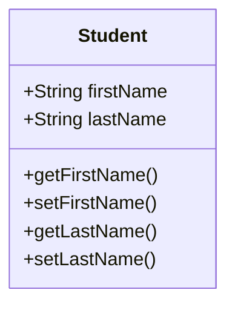

# Spring REST HelloWorld Controller

REST client (Postman) <---> REST Service (Code)

REST endpoint:
/test/hello/

## REST Web Service development process

1. Add Maven dependency for **Spring Boot Starter Web MVC**
(either in the pom.xml file directly or by using the
**Spring Initializr**)

File: pom.xml
```xml
    <!-- Add Spring Boot Starter Web MVC-->
    <dependency>
        <groupId>org.springframework.boot</groupId>
        <artifactId>spring-boot-starter-webmvc</artifactId>
    </dependency>
```


2. Create Sring REST service using ```@RestController```

```java
@RestController
@RequestMapping("/test")
public class DemoRestController {

    @GetMapping("/hello")
    public String sayHello() {
        return "Hello, Neo";
    }
}
```

# Create a New Service /api/students

Request Line = <code>GET</code> 

Endpoint = /api/students

The REST service will return ```List<Student>```, which
needs to be converted into JSON data.

## Student List REST API development process

1. Create POJO for the Student class



2. Create Spring REST Service using ```@RestController```

File: StudentRestController.java
```java
@RestController
@RequestMapping("/api")
public class StudentRestController {

    // Define endpoint for "/students"
    @GetMapping("/students")
    public List<Student> getStudents() {

        List<Student> theStudents = new ArrayList<>();
        theStudents.add(new Student("Rodrigo","Hurtado"));
        theStudents.add(new Student("Compare","Gera"));
        theStudents.add(new Student("Emiliano", "Gonce"));

        // Jackson converts List<Student> to JSON array
        return theStudents; 
    }
}
```

# Path Variables with @PathVariable

Retrieve a single student by studentId.

```GET``` /api/students/{studentId}

```java
@RestController
@RequestMapping("/api")
public class StudentRestController {

    // New endpoint
    @GetMapping("/students/{studentId}")
    public Student getStudent(@PathVariable int studentId) {

        List<Student> theStudents = new ArrayList<>();
        // Manually Populate the students

        // Index into the list
        return theStudent.get(studentId);
    }
}
```