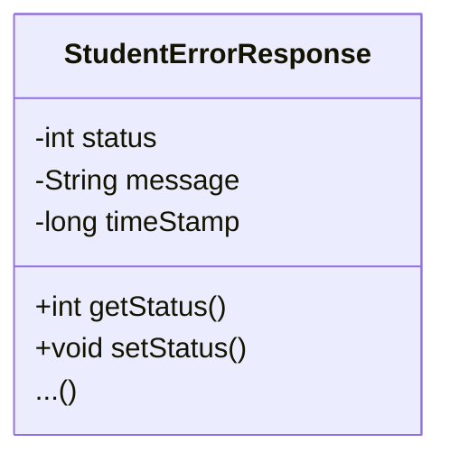

# Exception Handling with Spring

Desired output when sending a bad request:
```json
 {
    "status" : 404,
    "message" : "Student ID not found - 9999",
    "timeStamp" : 15261496
 }
```

## Development Process

1. Create a custom error response class.
The custom error response class will be sent back to the
client as JSON.


File: <code>StudentErrorResponse.java</code>
```java
public class StudentErrorResponse {

    private int status;
    private String message;
    private long timestamp;

    // Getters and setters
}
```

2. Create a custom student exception class, which will be
used by the REST service.
If a student cannot be found, an exception will be thrown.

File: <code>StudentNotFoundException.java</code>

```java
public class StudentNotFoundException extends RuntimeException {

    // Calls the constructor of RuntimeException
    public StudentNotFoundException(String message) {
        super(message);
    }
}
```

3. Update REST service to throw exception if student
is not found.

```java
@RestController
@RequestMapping("/api")
public class StudentRestController {

    @GetMapping("/students/{studentId}")
    public Student getStudent(@PathVariable int studentId) {
        // Check the studentId against the list size
        if(studentId < 0 || studentId >= theStudents.size()) {
            throw new StudentNotFoundException("Student id = " + studentId + " not found ");
        }

        return theStudents.get(studentId);
    }
}
```

4. Add an **exception handler** method using
<code>@ExceptionHandler</code> which returns a
<code>ResponseEntity</code>.

The ResponseEntity is a wrapper for the HTTP response
object. The ResponseEntity gives you fine-grained control to
specify:

- HTTP Status Code (response Line)
- HTTP Headers (metadata)
- Response Body (message)

In
<code>ResponseEntity\<StudentErrorResponse\> </code> you
specify the **type of the response body**.

```java
@RestController
@RequestMapping("/api")
public class StudentRestController {
    // ...

    @ExceptionHandler
    public ResponseEntity<StudentErrorResponse> handleException(StudentNotFoundException exc) {

        StudentErrorResponse error = new StudentErrorResponse();

        error.setStatus(HttpStatus.NOT_FOUND.value());
        error.setMessage(exc.getMessage());
        error.setTimeStamp(System.currentTimeMillis());

        return new ResponseEntity<>(error, HttpStatus.NOT_FOUND);
    }
}
```

## Add Exception Handler for string bad requests