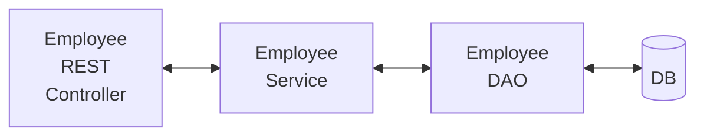

# REST API with Spring Boot that Connects to a DB

## API Requirements

- Create a REST API for the Employee Directory
- REST clients should be able to:
    - GET a list of employees
    - GET a single employee by ID
    - CREATE a new employee
    - UPDATE an employee
    - DELETE an employee

Main Entity: Employees

## Use HTTP methods to assign action on resource

|    CRUD action | HTTP Method | Endpoint            |
|   :------:     | :------:    | :------             |
|   CREATE       |   POST      | /api/employees      |
|   READ         |   GET       | /api/employees      |
|   READ         |   GET       | /api/employees/{employeeId}|
|   UPDATE       |   PUT       | /api/employees      |
|   DELETE       |   DELETE    | /api/employees/{employeeId}|

## Development Process for a Full CRUD REST API

1. Set up database DEV enviroment.
2. Create Spring Boot project with **Spring Initializr**.
3. GET list of employees.
4. GET single employee by ID.
5. CREATE an employee.
6. UPDATE an employee.
7. DELETE an employee.

## Application Architecture



## Setup Database Dev Environement

> From "MySQLWorkbench" run the script: **employee.sql**
This will create a database schema called
"employee_directory" and a database table called "employee"

```sql
SELECT * FROM employee_directory.employee;
```

## Spring Initializr

Package name = com.neo_1042.crud_employee

|Dependencies | Description |
| :------     | :------     |
| Spring Web       | Build web, RESTful applications using Spring MVC. Uses Apache Tomcat as the default embbeded container. |
| Spring Data JPA  | Persist data with JPA, Spring Data and Hibernate |
| Spring Dev Tools | Provides fast application restarts and LiveReload |
| MySQL Driver     | MySQL JDBC Driver |

---> Import project into IntelliJ IDEA/Visual Studio Code.