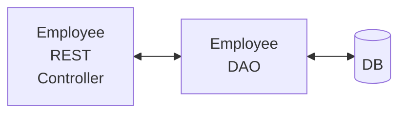
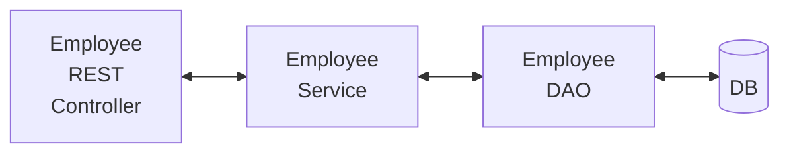
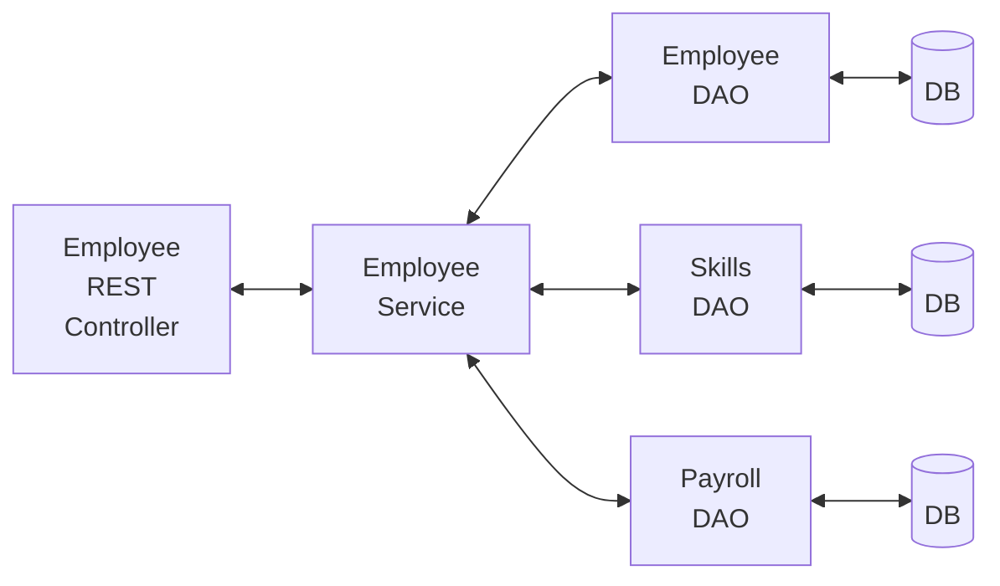

# REST API with Spring Boot that Connects to a DB

## API Requirements

- Create a REST API for the Employee Directory
- REST clients should be able to:
    - GET a list of employees
    - GET a single employee by ID
    - CREATE a new employee
    - UPDATE an employee
    - DELETE an employee

Main Entity: Employees

## Use HTTP methods to assign action on resource

|    CRUD action | HTTP Method | Endpoint            |
|   :------:     | :------:    | :------             |
|   CREATE       |   POST      | /api/employees      |
|   READ         |   GET       | /api/employees      |
|   READ         |   GET       | /api/employees/{employeeId}|
|   UPDATE       |   PUT       | /api/employees      |
|   DELETE       |   DELETE    | /api/employees/{employeeId}|

## Development Process for a Full CRUD REST API

1. Set up database DEV enviroment.
2. Create Spring Boot project with **Spring Initializr**.
3. GET list of employees.
4. GET single employee by ID.
5. CREATE an employee.
6. UPDATE an employee.
7. DELETE an employee.

## (Initial) Application Architecture Design



## Setup Database Dev Environement

> From "MySQLWorkbench" run the script: **employee.sql**
This will create a database schema called
"employee_directory" and a database table called "employee"

```sql
SELECT * FROM employee_directory.employee;
```

## Spring Initializr

Package name = com.neo_1042.crud_employee

|Dependencies | Description |
| :------     | :------     |
| Spring Web       | Build web, RESTful applications using Spring MVC. Uses Apache Tomcat as the default embbeded container. |
| Spring Data JPA  | Persist data with JPA, Spring Data and Hibernate |
| Spring Dev Tools | Provides fast application restarts and LiveReload |
| MySQL Driver     | MySQL JDBC Driver |

---> Import project into IntelliJ IDEA/Visual Studio Code.

# Employee DAO with JPA

**Use the SAME interface for a consistent API**

```java

@Repository
public class EmployeeDAOJPAImpl implements EmployeeDAO {

    private EntityManager entityManager;

    @Autowired
    public EmployeeDAOJPAImpl(EntityManager theEntityManager) {
        entityManager = theEntityManager;
    }
}
```

## Get a List of Employees (Standard JPA)

```java
@Override
public List<Employee> findAll() {

    // Create a typed query
    TypedQuery<Employee> theQuery
        = entityManager.createQuery("FROM Employee", Employee.class);

    // Execute query and get result list
    List<Employee> employees = theQuery.getResultList();

    // Return the results
    return employees;
}
```

Next steps in code:

1. Update DB configuration in `application.properties`
2. Code Employee entity
3. Code DAO interface
4. Code DAO implementation
5. Code a REST controller to use the DAO

# Refactor: Add a Service (FACADE) Layer



## Purpose of the Service Layer

[+] Service Facade Design Pattern

[+] Intermediate layer for **custom business logic**.

[+] Integrate data from multiple sources (DAO/Repositories).



[+] Provide the controller with a **single view** of the data
that we integrated from multiple backend datasources.

## Specialized Annotation for Services

- Spring provides the @Service annotation.

::: mermaid
graph TD;
    A["@Component"]-->B["@RestController"];
    A-->C["@Repository"];
    A-->D["@Service"];
:::

Spring will automatically register the 
**Service implementation**
thanks to component-scanning.

### Development Process for the Service Interface

1. Define Service interface

```java
public interface EmployeeService {
    List<Employee> findAll();
}
```

2. Define Service implementation  
Inject the EmployeeDAO

```java
@Service
public class EmployeeServiceImpl implements EmployeeService {
    
    // Constructor injection -> EmployeeDAO
    @Override
    public List<Employee> findAll() {
        return employeeDAO.findAll();
    }
}
```

# Service Layer: Best Practices

- Apply transactional boundaries at the service layer.
- It is the service layer's responsability to manage
transaction boundaries.
- For implementation code:
    - Apply `@Transactional` on service methods.
    - Remove `@Transactional` on DAO methods if they already
    exist.

# DAO: READ a single employee by ID (findById)

```java
public class EmployeeDAOJPAImpl implements EmployeeDAO {
    // ...
    @Override
    public Employee findById(int theId) {

        Employee theEmployee = entityManager.find(Employee.class, theId);

        return theEmployee;
    }
}
```

# DAO: CREATE or UPDATE Employee (save or update)

```java
@Override
public Employee save(Employee the Employee) {

    // If id == 0, then save/insert. Else, update
    Employee dbEmployee = entityManager.merge(theEmployee);

    // dbEmployee has the updated if from the database.
    return dbEmployee;
}
```

# DAO: DELETE an existing employee (remove)

```java
@Override
public void deleteById(int theId) {
    // Find the employee by id
    Employee theEmployee = entityManager.findById(Employee.class, theId);

    // Delete the employee
    entityManager.remove(theEmployee);
}
```

> Reminder: When sending JSON to Spring REST Controllers,
don't forget to set an **HTTP request header**:

`Content-type: application/json`

Using POSTMAN, we set the HTTP request header in:  
Body > raw > JSON (application/json).