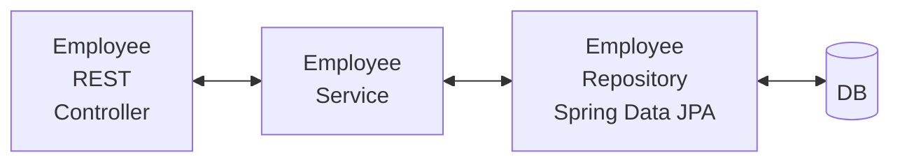
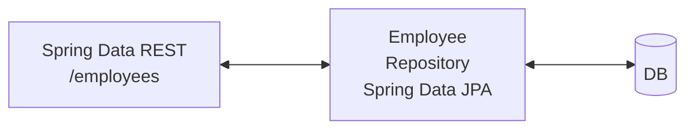

# Spring Data JPA

In previous projects, we made use of the standard JPA API.
Now, we are switching to **Spring Data JPA**.

### The Problem: What if we need a DAO for another Entity?

Reminder:

```java
public interface EmployeeDAO {

    public List<Employee> findAll();
    
    public Employee findById(int theId);

    public void save(Employee theEmployee);

    public void deleteById(int theId);
}

// ...

@Repository
public class EmployeeDAOImpl implements EmployeeDAO {
    // Methods implementation
}
```

So, if we need to create a DAO for:  
{Customer, Student, Product, Book, ...}  
Do we have to repeat all of the same code again???

Pattern for creating DAOs:
```java
// Entity Type = Employee, PK = id (tbl_employee)
@Override
public Employee findById(int theId) {
    // Get the data
    Employee theData = entityManager.find(Employee.class, theId);

    // Return the data
    return theData;
}
```

# My Wish

I wish I could tell Spring:

- Create a DAO for me.
- Plug in my Entity type and a PK (Primary Key).
- Give me all of the basic CRUD features.

```
Entity = BOOK, CUSTOMER, PRODUCT, ...
PK = Integer

findAll()
findById()
save()
deleteById()
...
```

## Spring Data JPA is the solution!

> More than 70% reduction in code. More abstraction.
Less errors.

- Spring Data JPA provides the interface: `JpaRepository`
- Exposes the DAO methods (some by inheritance from parents)

Documentation =>
[www.luv2code.com/jpa-repository-javadoc](www.luv2code.com/jpa-repository-javadoc)

# Development Process

1. Extend the `JpaRepository` interface:

```java
public interface EmployeeRepository extends JpaRepository<Employee, Integer> {
    // That's it!
}

// There is NO NEED for an implementation class.
```

2. Use your Repository in your app.

```java
@Service
public class EmployeeServiceImpl implements EmployeeService {

    private EmployeeRepository employeeRepository;

    // Constructor injection
    @Autowired
    public EmployeeServiceImpl(EmployeeRepository theEmployeeRepository) {
        employeeRepository = theEmployeeRepository;
    }

    // This is one of the methods that we get "for free",
    // By simply extending the JpaRepository<> interface
    @Override
    public List<Employee> findAll() {

        return employeeRepository.findAll();
    }
}
```

## Spring Data JPA Advanced Features

- Extending and adding custom queries with JPQL.
- Query Domain Specific Language (Query DSL)
- Defining custom methods (lower-level coding)

# Migrate from Manual JPA to JpaRepository

1. Delete all DAOs from the dao package (not the actual folder)
2. Substitute this by the "EmployeeRepository.java" interface,  
extending "JpaRepository<Employee,Integer>"

3. At the service layer, substitute "EmployeeDAO" to
"EmployeeRepository", including all of the calls to the DAO.

4. Remove the `@Transactional` annotations in the 
"EmployeeServiceImpl.java" file, since `JpaRepository`
provides this functionality.

5. Refactor all necessary code that show errors:
`You cannot convert Optional<Employee> to Employee`, by doing:

```java
// Optional was introduced from Java 8
import java.util.Optional;

@Override
public Employee findById(int id) {
    // Refactor as a local variable
    // Optional is a different pattern that replaces having to check for nulls.
    // java.util.Optional was introduced from Java 8
    Optional<Employee> result = employeeRepository.findById(id);

    Employee theEmployee = null;

    if (result.isPresent()) {
        theEmployee = result.get();
    } else {
		throw new RuntimeException("Did not find employee");
	}
    return theEmployee;
}
```

# Spring Data REST

[https://spring.io/projects/spring-data-rest](https://spring.io/projects/spring-data-rest)

Spring Data REST allows you to have a full
REST CRUD implementation, by only specifying the new
needed entity with its PK.

- Spring Data REST will scan your project for
any `JpaRepository`.
- Expose REST APIs for each entity type for your
`JpaRepository`.

- By default, Spring Data REST will create endpoints
based on entity type.

- Simple pluralized form:
    - The first character of the Entity type is lowercase
    - Just add an "s" at the end:

`[...]extends JpaRepository<Employee, Integer> ---> /employees`

# Spring Data REST Development Process

1. Add Spring Data REST to your maven pom.xml file.

```xml
    <dependency>
        <groupId>org.springframework.boot</groupId>
        <artifactId>spring-boot-starter-data-rest</artifactId>
    </dependency>
```

## In a Nutshell

1. The Entity = `Book`
2. JpaRepository =  
    `BookRepository extends JpaRepository<Book, Integer>`
3. Maven POM dependency = `spring-boot-starter-data-rest`

### BEFORE Spring Data REST (Spring Data JPA only):



### AFTER Spring Data REST:



# HATEOAS

- Spring Data REST endpoints are HATEOS-compliant.  
HATEOS = **Hypermedia as the Engine of Application State**

- Hypermedia-driven sites provide information to access
REST interfaces --> Metadata for the REST data.

- Spring Data REST response using HATEOAS
- For example, a REST response from: `GET: /employees/10`

```json
{
    "firstName" : "Neo",
    "lastName" : "Rabbit",
    "email" : "neo@matrix.com",
    "_links" : {
        "self" : {
            "href" : "http://localhost:8080/employees/10"
        },
        "employee" : {
            "href" : "http://localhost:8080/employees/10"
        }
    }
}
```

- For a collection, the metadata includes the page size,
total elements, pages, totalElements, number, etc.

> HATEOAS uses the Hypertext Application Language = HAL
data format.

# Spring Data REST Advanced Features

- Pagination, sorting and searching.
- Extending and adding custom queries with JPQL.
- Query Domain Specific Language (Query DSL).

# Migrating to Spring Data REST

- Delete the *DAOImpl.java files.
- Delete the CONTROLLER (`rest/`) package.
- Delete the SERVICE (`service/`) package.

# Build Process (Reminder):

1. Start the MySQL server and run the initial scripts:
```bash
sudo /usr/local/mysql/support-files/mysql.server start
# Access
/usr/local/mysql/bin/mysql -u root -p

source /Users/rafael1642/GIT/Projects/spring-boot-demo/crud_employees/spring-boot-employee-sql-script/employee-directory.sql
```

2. Build and run the application:
```bash
cd ~/GIT/Projects/spring-boot-demo/crud_employees
# Build
./mvnw package

# Run
java -jar target/crud_employees-0.0.1-SNAPSHOT.jar

# New Endpoint:
localhost:8080/employees
```

# Customize our Endpoint Base Path

File = src/main/resources/application.properties

```properties
# Spring Data REST customization
spring.data.rest.base-path=/magic-api
```

New endpoint = `http://localhost:8080/magic-api/employees`

## IMPORTANT: Spring Data REST only uses the IDs as PathVariables.

http://localhost:8080/magic-api/employees

Body = { "id" : 4 , ...}

becomes:

http://localhost:8080/magic-api/employees/4