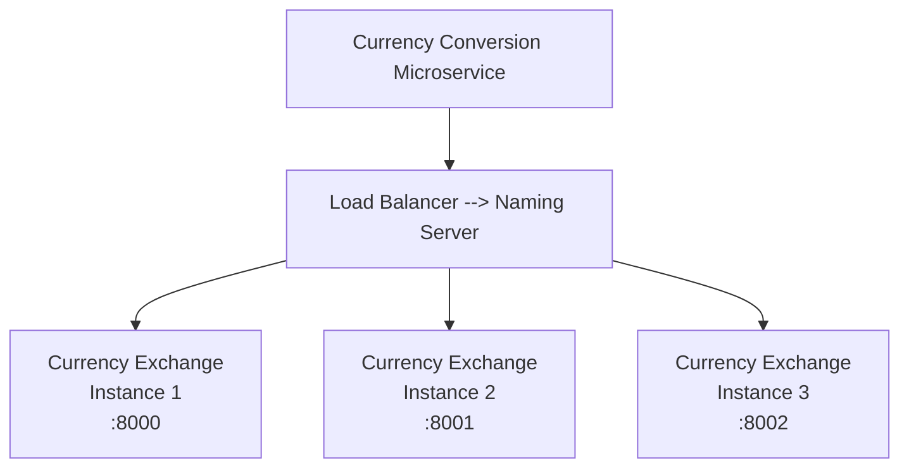

# Currency Exchange Project

1. Currency Conversion Microservice.
2. Currency Exchange Microservice.

```
http://localhost:8000/currency-exchange/from/USD/to/MXN
http://localhost:8000/currency-exchange/from/USD/to/MXN/quantity/10
```

<u>Project Dependencies</u>:

1. Spring Web
2. Spring Boot Dev Tools
3. Config Client
4. Spring Boot Actuator

### application.properties (Reminder)

```properties
spring.application.name=currency-exchange
spring.config.import=optional:configserver:http://localhost:8888
server.port=8000
```

### Currency Exchange Service

URL -> `http://localhost:8000/currency-exchange/from/USD/to/INR`

Response Structure:

```json
{
    "id" : 10001,
    "from" : "USD",
    "to" : "INR",
    "conversionMultiple": 65.00,
    "environment" : "8000 instance-id"
}
```

### Currency Conversion Service

URL -> `http://localhost:8100/currency-conversion/from/USD/to/INR/quantity/10`

Response Structure:

```json
{
    "id" : 10001,
    "from" : "USD",
    "to" : "INR",
    "quantity" : 10,
    "conversionMultiple": 650.00,
    "environment" : "8000 instance-id"
}
```

# Load Balancing



### Dynamic Port. JVM Arguments:

```
-Dserver.port=8002
```

## H2 Database (Spring Dependencies)

The H2 Database provides in-memory DB that supports JDBC,
API and R2DBC access, with a small (2 MB) footprint.
Supports embedded and server modes, as well as a browser
based console application.

From Spring 4.x, H2 is split into -> h2 + h2Console.

Add to the pom.xml: (if not already added from the Spring
Initializr).

```xml
<dependencies>
    <!-- -->
    <dependency>
        <groupId>org.springframework.boot</groupId>
        <artifactId>spring-boot-starter-data-jpa</artifactId>
    </dependency>
    <dependency>
        <groupId>com.h2database</groupId>
        <artifactId>h2</artifactId>
        <scope>runtime</scope>
    </dependency>
    <!--From Spring Boot 4.x on, add the h2 console separately-->
    <dependency>
        <groupId>org.springframework.boot</groupId>
        <artifactId>spring-boot-h2console</artifactId>
    </dependency>
</dependencies>
```