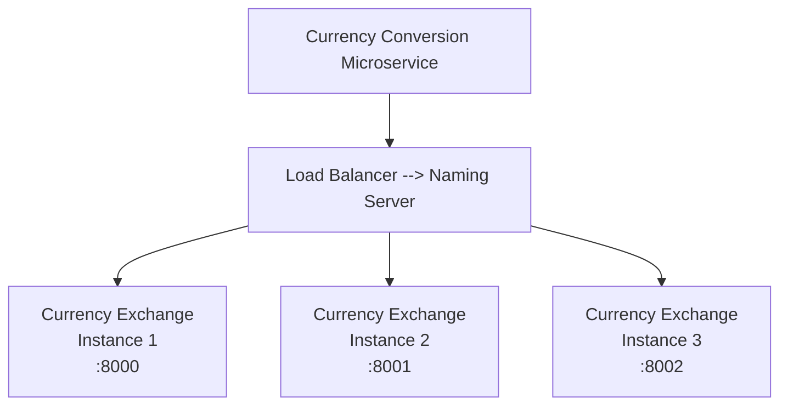

# Currency Exchange Project

1. Currency Conversion Microservice.
2. Currency Exchange Microservice.

```
http://localhost:8000/currency-exchange/from/USD/to/MXN
http://localhost:8000/currency-exchange/from/USD/to/MXN/quantity/10
```

<u>Project Dependencies</u>:

1. Spring Web
2. Spring Boot Dev Tools
3. Config Client
4. Spring Boot Actuator

### application.properties (Reminder)

```properties
spring.application.name=currency-exchange
spring.config.import=optional:configserver:http://localhost:8888
server.port=8000
```

### Currency Exchange Service

URL -> `http://localhost:8000/currency-exchange/from/USD/to/INR`

Response Structure:

```json
{
    "id" : 10001,
    "from" : "USD",
    "to" : "INR",
    "conversionMultiple": 65.00,
    "environment" : "8000 instance-id"
}
```

### Currency Conversion Service

URL -> `http://localhost:8100/currency-conversion/from/USD/to/INR/quantity/10`

Response Structure:

```json
{
    "id" : 10001,
    "from" : "USD",
    "to" : "INR",
    "quantity" : 10,
    "conversionMultiple": 650.00,
    "environment" : "8000 instance-id"
}
```

# Load Balancing



### Dynamic Port. JVM Arguments:

```
-Dserver.port=8002
```

## H2 Database (Spring Dependencies)

The H2 Database provides in-memory DB that supports JDBC,
API and R2DBC access, with a small (2 MB) footprint.
Supports embedded and server modes, as well as a browser
based console application.

From Spring 4.x, H2 is split into -> h2 + h2Console.

Add to the pom.xml: (if not already added from the Spring
Initializr).

```xml
<dependencies>
    <!-- -->
    <dependency>
        <groupId>org.springframework.boot</groupId>
        <artifactId>spring-boot-starter-data-jpa</artifactId>
    </dependency>
    <dependency>
        <groupId>com.h2database</groupId>
        <artifactId>h2</artifactId>
        <scope>runtime</scope>
    </dependency>
    <!--From Spring Boot 4.x on, add the h2 console separately-->
    <dependency>
        <groupId>org.springframework.boot</groupId>
        <artifactId>spring-boot-h2console</artifactId>
    </dependency>
</dependencies>
```

# H2 Console Errors

Be careful when adding the dependencies, as well as the
application.properties file:

```properties
# Adding H2 DB + JPA
spring.jpa.show-sql=true
spring.datasource.url=jdbc:h2:mem:testdb
spring.h2.console.enabled=true
```

## Adding a table to the H2 Database

Simply add the `@Entity` and `@Id` annotations from:

```java
import jakarta.persistence.Entity;
import jakarta.persistence.Id;
```

## 1. Add a CurrencyExchange Entity:

File = CurrencyExchange.java
```java
@Entity
public class CurrencyExchange {

    @Id
    private Long id;

    @Column(name="currency_from")
    private String from;

    @Column(name = "currency_to")
    private String to;

    private BigDecimal conversionMultiple;

    private String environment;

    // Constructors, getters and setters...
}
```

## 2. Add data to your H2 DB

File = src/main/resources/data.sql
```sql
INSERT INTO CURRENCY_EXCHANGE(id, currency_from, currency_to, conversion_multiple, environment)
VALUES (10001, 'USD', 'INR', 65, '');
INSERT INTO CURRENCY_EXCHANGE(id, currency_from, currency_to, conversion_multiple, environment)
VALUES (10002, 'EUR', 'INR', 75, '');
INSERT INTO CURRENCY_EXCHANGE(id, currency_from, currency_to, conversion_multiple, environment)
VALUES (10003, 'AUD', 'INR', 25, '');

COMMIT;
```

## 3. Add a Repository that extends JpaRepository

File = CurrencyExchangeRepository.java
```java
public interface CurrencyExchangeRepository 
    extends JpaRepository<CurrencyExchange, Long> {
    
    // Spring Data JPA will convert this to a SQL query
    CurrencyExchange findByFromAndTo(String from, String to);
}
```

## 4. Call this from the Controller

File = CurrencyExchangeController.java

```java
@RestController
public class CurrencyExchangeController {

    // Choose: org.springfamework.core.env.Environment;
    @Autowired
    private Environment env;

    @Autowired
    private CurrencyExchangeRepository repository;

    @GetMapping("/currency-exchange/from/{from}/to/{to}")
    public CurrencyExchange retrieveExchangeValue(
            @PathVariable String from,
            @PathVariable String to) {

        // This did not need an implementation :O
        CurrencyExchange currencyExchange = repository.findByFromAndTo(from, to);

        if(currencyExchange == null) {
            throw new RuntimeException("Unable to find data for: from = " + from + ", to = " + to);
        }

        String port = env.getProperty("local.server.port");

        currencyExchange.setEnvironment(port);

        return currencyExchange;
    }
}
```