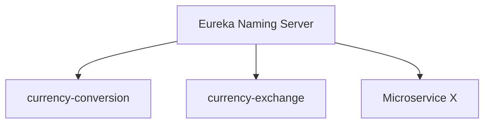

# Eureka Naming Server

What if the URL of a given microservice changes?
How will other components be able to talk to this microservice?

Microservices should be able to find each other, no matter
which port they are assigned to.



If Microservice X has 5 instances running, all 5 instances
will be registered with the **Eureka Service Registry**.

Eureka knows all the current locations.

Suppose M1 wants to communicate with M2, which has 5 instances
up and running.

1. M1 asks the Load Balancer (Gateway).
2. The Load Balancer asks Eureka.
3. Eureka responds "Go to Instance 3"
4. The Gateway routes requests-responses to Instance #3

# Setting up Eureka Naming Server (Initializr)

- GroupId = com.neo_1042.microservices
- ArtifactId = naming-server

Dependencies = {Dev Tools, Actuator, Eureka Server}

Add this annotation to the main app file:
```java
@EnableEurekaServer
```

Add this to the properties file:
```properties
spring.application.name=naming-server
server.port=8761

eureka.client.register-with-eureka=false
eureka.client.fetch-registry=false
```

## Debugging Problems with Eureka:

Apply these settings in each `application.properties` file of each microservice:

```properties
eureka.instance.prefer-ip-address=true
# OR
eureka.instance.hostname=localhost
```

# Connecting our Microservices to the Naming Server

Add this dependency to each microservice's main POM file:
File = pom.xml
```xml
<dependency>
    <groupId>org.springframework.cloud</groupId>
    <artifactId>spring-cloud-starter-netflix-eureka-client</artifactId>
</dependency>
```

Plus, add the naming server URL to the properties file:  
currency-exchange + currency-conversion:
```properties
eureka.client.serviceUrl.defaultZone=http://localhost:8761/eureka
```