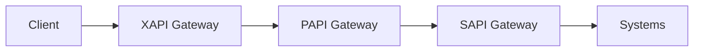

# API-Led Connectivity (MuleSoft)

1. **System APIs (SAPI)** --> Unlock and expose data/functions
from "systems of record or persistence" (ERP, DBs, SaaS, legacy).
They are typically stable and close to the underlying system.

2. **Process APIs (PAPI)** --> orchestrate business processes by
combining and transforming data across multiple SAPIs,
encapsulating business workflows.

3. **Experiencie APIs (XAPI)** --> shape and tailor the data for
a specific consumer experience (mobile app, web app, partner,
BFF), often aggregating/formatting what the PAPI exposes.

# Eureka vs Gateway Servers

## Eureka Server = Service Registry and Discovery

Eureka is a directory or "phone book" where microservices
register themselves and discover others dynamically
without hardcoding the host or port. It enables resilience
in dynamic environments (scale up or down, new instances,
pods moving).

## Gateway Server = API Gateway/Reverse Proxy

A gateway is a **single entry point** that routes requests to
downstream services and centralizes cross-cutting concerns
(authentication, logging, rate limiting, headers/path rewrite,
etc). In **Spring Cloud Gateway**, requests go through:

route matching + filter chains  (global + route filters).

## How the Eureka and Gateway Servers Work Together

They are complementary: the gateway can use discovery to
route to services by a logical name (load-balanced) rather
than fixed URLs.

## Pattern: Eureka + Gateway per Layer (XAPI, PAPI, SAPI)

Each layer has its own Gateway and its own Eureka server.

### Some Tips

- Don't confuse boundaries: Gateway handles policy + routing,
Eureka handles discovery.
- If you do multiple gateways, avoid duplicating the same auth
three times; decide what is validated at each boundary
(edge auth vs service-to-service identity).
- If you do multiple Eurekas, do it for isolation or domain
partitioning, not because "each layer must have one".

> **Eureka already supports HA via clustering/replication**.